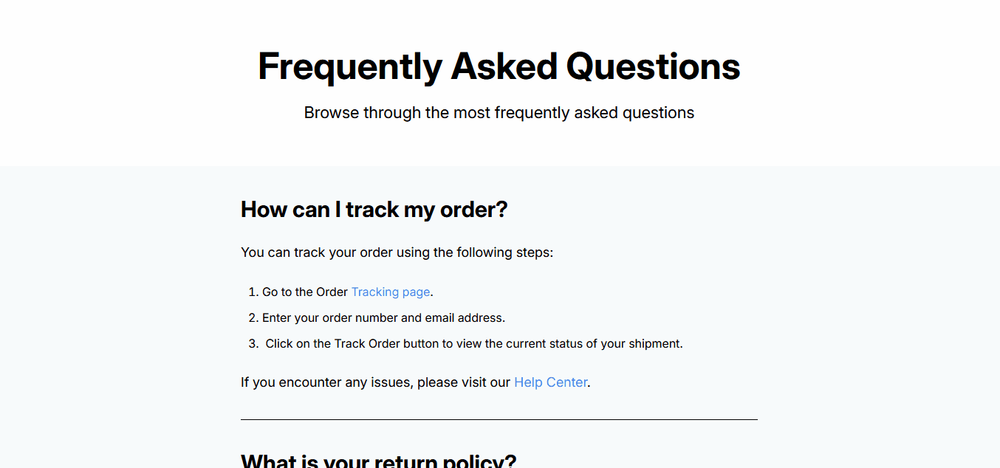
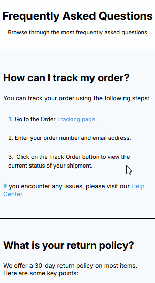

<h1 align="center">Frequently Asked Questions</h1>

<p align="center">
  Projeto da DevChallenges para praticar programação
</p>

<p align="center">
  
</p>

<br>

## 🚀 Tecnologias

- HTML CSS(Flex)
- Git Github

## 💻 Projeto

Serve para colocar em prática conhecimentos em Front-End. 

<p align="center">
  
</p>

## 📱 Mobile

<p align="center">
  
</p>

<div align="center">
  <p style="font-size: 20px"><a href="https://dev-challenges-simple-frequently-as.vercel.app/" target="_blank">Clique para acessar o link</a>
  </p>
</div>

## Conclusão

Projeto simples da DevChallenges para praticar Front-End.

Percebi que tinha muita coisa em comum em vários pontos do site, então utilizei bastante o "e" nos seletores CSS na hora de fazer a estilização de cada elemento. Aqui vai um exemplo:

```css
    section.order > .title, 
    section.policy > .title {
        font-size: 2rem;
    }
```

Aprendendo a organizar a estrutura CSS para facilitar o código. Ter empatia na hora de programar, para um possível outro programador dar manutenção futuramente.
